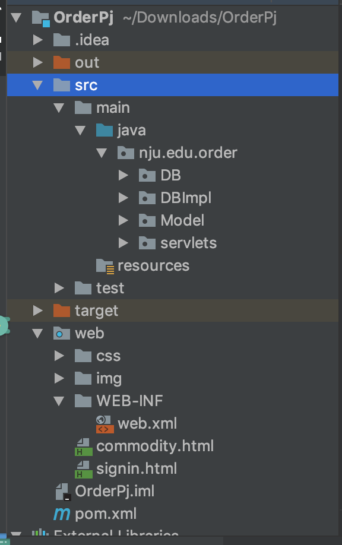

# 说明文档

161250041	侯韵晗

### 1.环境配置

需要将gson和mysql-connector-java包放入tomcat的lib文件夹下

### 2.使用技术

使用了servlet session JDBC技术

### 3.已有账号密码

id：hyh password：123

id：fbr  password：123

### 4.数据库结构

### 5.目录结构