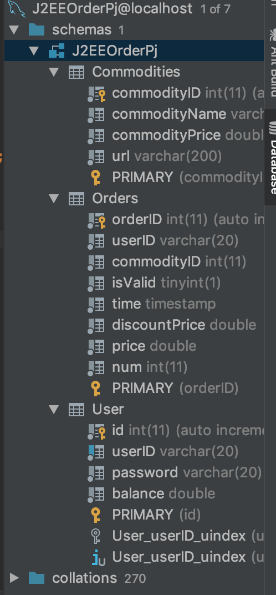
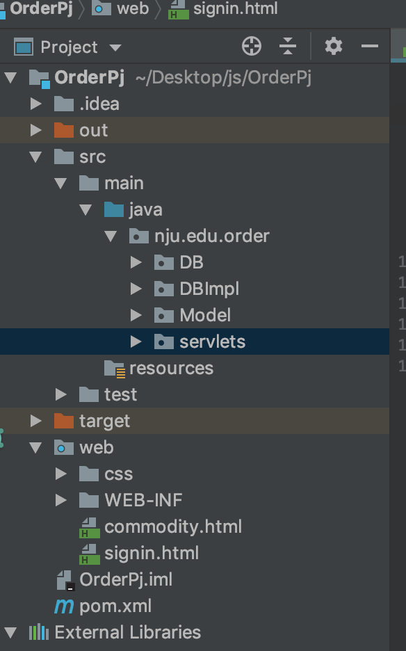

# 说明文档

161250041	侯韵晗

### 1.环境配置

需要将gson和mysql-connector-java包（在本文件夹中）放入tomcat的lib文件夹下

### 2.使用技术

使用了servlet session JDBC技术 使用了Filter和Listener

### 3.已有账号密码

Id：侯韵晗  password：123  （Filter解决中文乱码）

Id：hyh       password：123

### 4.Listener 

由nju.edu.order.servlets.MyListner实现

### 5.Filter 

由nju.edu.order.servlets.MyFilter 和 nju.edu.order.servlets.StrongRequest实现

### 6.数据库结构

### 7.目录结构

