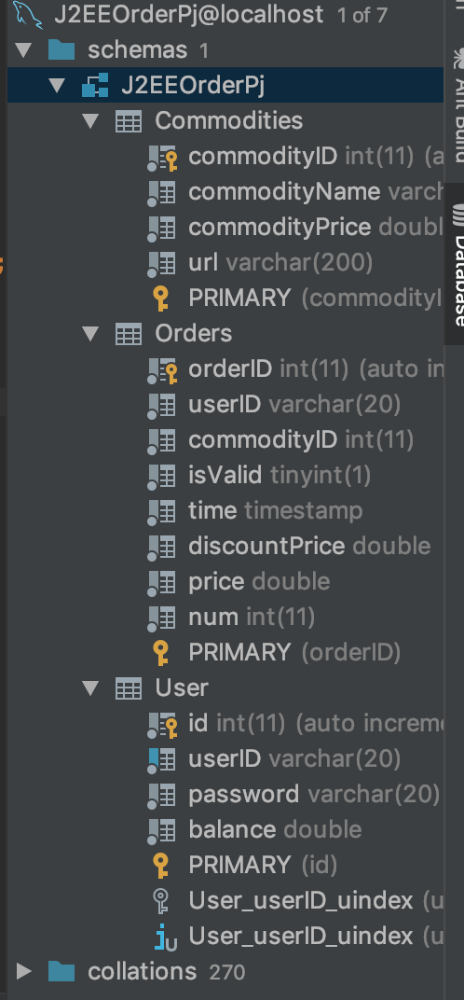
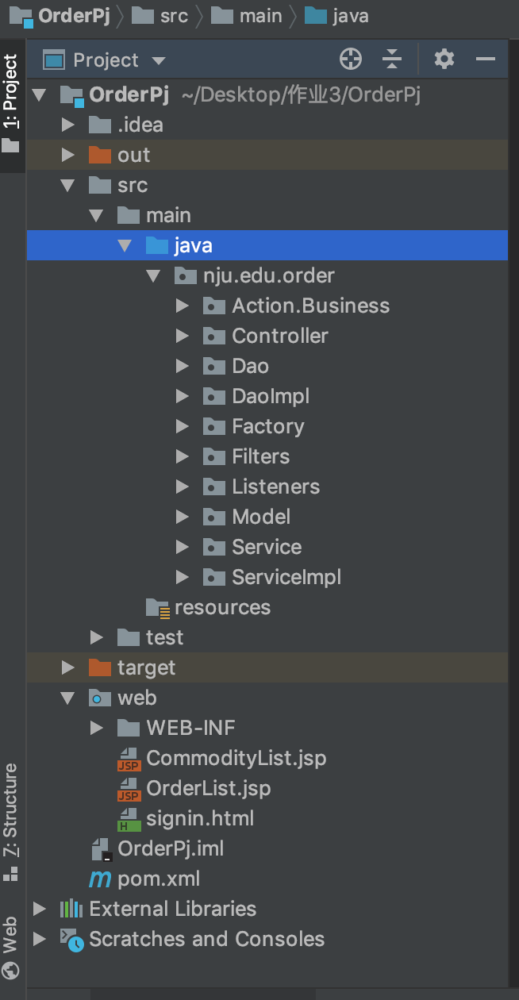

# 说明文档

161250041	侯韵晗

**（之前两次作业 数据库导出的数据可能有问题，如果需要的话可以用本次的数据替换）**

### 1.环境配置

需要将gson和mysql-connector-java包放入tomcat的lib文件夹下

### 2.使用技术

基于MVC DAO Service设计

### 3.已有账号密码

id：hyh password：123

id：侯韵晗  password：123

### 4.数据库结构

### 5.目录结构

