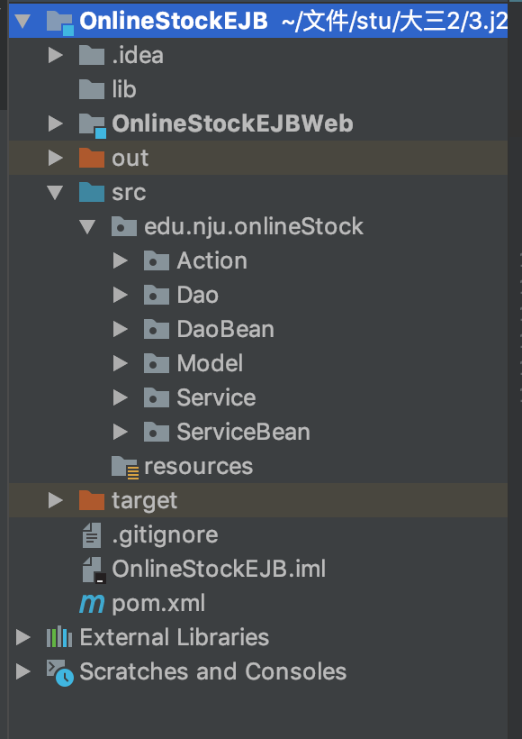
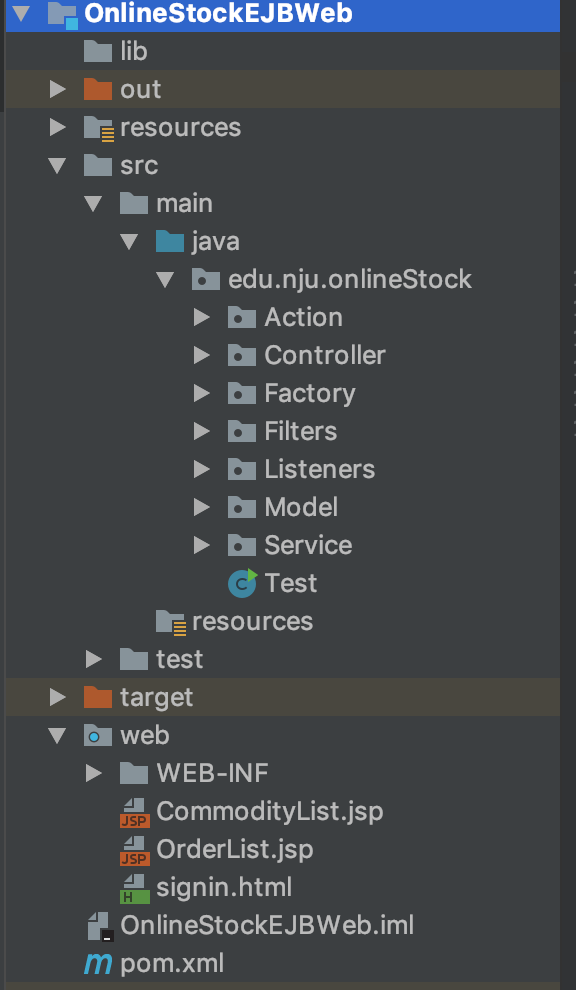
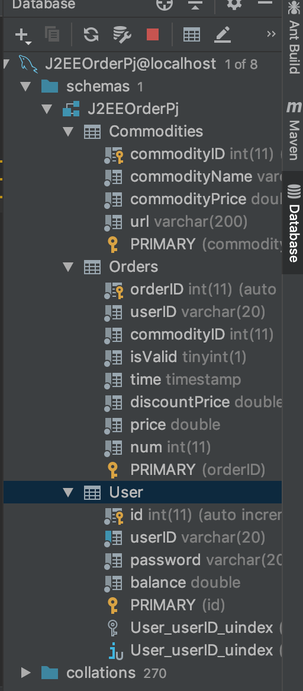

# 说明文档

161250041	侯韵晗

### 1.环境配置

wildfly

将jboss-client.jar（太大了就不上传了）拷贝到web端的WEB-INF/lib中（已在project structure中添加依赖）

### 2.使用技术

基于EJB JavaBean Servlet JSP设计

### 3.已有账号密码

id：hyh password：123

id：侯韵晗  password：123

### 4.目录结构

本次作业中将web项目放到了服务器端项目的文件夹中。虽然是放在一起（一开始为了方便测试），但还都是单独配置的，二者有各自独立的结构。

**OnlineStockEJB使用Wildfly启动**

**OnlineStockEJBWeb使用tomcat**

**Web与Service间使用JNDI，Service与Dao间使用@EJB annotation**

##### 服务器端

##### web

### 5.数据库结构

​	