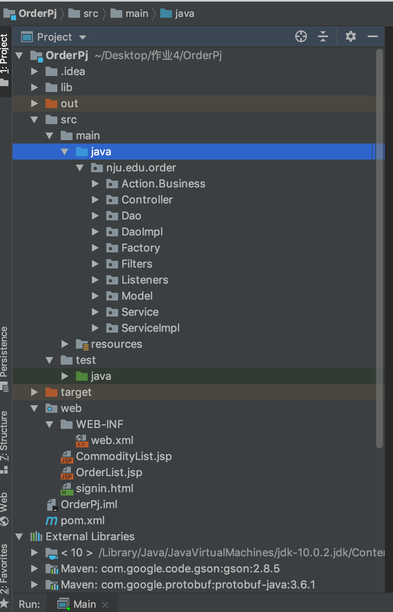

# 说明文档

161250041	侯韵晗

### 1.环境配置

使用了hibernate5

（因为文件大小在项目中删除了一些包）

将hibernate相关包放在项目的lib文件夹下

将hibernate相关包放在tomcat文件夹的lib下

Hibernate5：    **hibernate-release-5.2.7.Final.zip**

> dom4j-2.1.1
>
> classmate-1.3.4.jar
>
> hibernate-commons-annotations-5.0.4.Final
>
> hibernate-core-5.3.7.Final
>
> c3p0-0.9.5.2
>
> hibernate-c3p0-5.0.4.Final
>
> jaxb-core-2.3.0.jar 
>
> jaxb-impl-2.3.0.jar 
>
> jaxb-api-2.3.0.jar 
>
> javax.persistence-api-2.2.jar 
>
> antlr-2.7.7.jar(生成SQL语句)
>
> jandex-2.0.5.Final.jar
>
> hibernate-jpa-2.1-api-1.0.2.Final.jar
>
> byte-buddy-1.8.17.jar 
>
> javax.activation-api-1.2.0.jar 
>
> jboss-logging-3.3.2.Final.jar 
>
> jboss-transaction-api_1.2_spec-1.1.1.Final.jar
>
> mchange-commons-java-0.2.11.jar
>
> javassist-3.20.0-GA.jar

### 2.使用技术

Hibernate DAO+Service+Servlet+JSP

（在作业4的基础上修改了modle 添加了Hibernate framework）

### 3.已有账号密码

id：hyh password：123

id：侯韵晗  password：123

### 4.目录结构

***.hbm.xml文件和hibernate.cfg.xml文件都在src/resources中**

### 5.数据库结构

