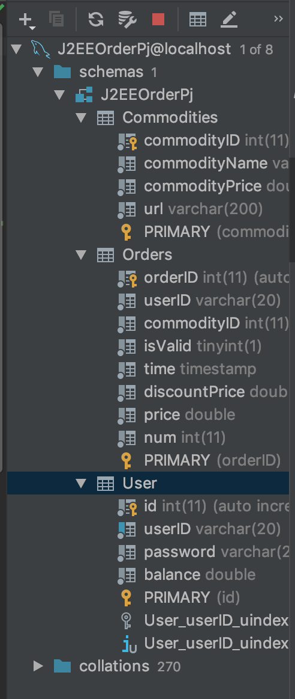

# 说明文档

161250041	侯韵晗

### 1.环境配置

将spring c3p0 hibernate相关包放在项目的lib文件夹下

将相关包放在tomcat文件夹的lib下

```
aopalliance-1.0.jar
aspectjweaver-1.9.1.jar
commons-logging-1.2.jar
spring-beans-4.3.18.RELEASE.jar
spring-orm-4.3.18.RELEASE.jar
spring-test-4.3.18.RELEASE.jar
spring-tx-4.3.18.RELEASE.jar
spring-instrument-tomcat-4.3.18.RELEASE.jar
spring-aspects-4.3.18.RELEASE.jar
spring-context-support-4.3.18.RELEASE.jar
spring-aop-4.3.18.RELEASE.jar
spring-context-4.3.18.RELEASE.jar
spring-core-4.3.18.RELEASE.jar
spring-expression-4.3.18.RELEASE.jar
spring-instrument-4.3.18.RELEASE.jar
spring-jdbc-4.3.18.RELEASE.jar
spring-jms-4.3.18.RELEASE.jar
spring-messaging-4.3.18.RELEASE.jar
spring-oxm-4.3.18.RELEASE.jar
hibernate-c3p0-5.0.4.Final.jar
hibernate-core-5.3.7.Final.jar
jboss-transaction-api_1.2_spec-1.1.1.Final.jar
antlr-2.7.7.jar
byte-buddy-1.8.17.jar
dom4j-2.1.1.jar
jandex-2.0.5.Final.jar
javassist-3.23.1-GA.jar
javax.activation-api-1.2.0.jar
javax.persistence-api-2.2.jar
jboss-logging-3.3.2.Final.jar
hibernate-commons-annotations-5.0.4.Final.jar
classmate-1.3.4.jar
```


### 2.使用技术

Hibernate Spring 

（在作业7的基础上修改了Service Dao层+Spring）


### 3.已有账号密码

id：hyh password：123

id：侯韵晗  password：123


### 4.目录结构

**applicationContext.xml（注入Bean采用注解方式，事务管理采用声明方式，使用c3p0数据源）
CommoditiesEntity.hbm.xml
OrdersEntity.hbm.xml
UserEntity.hbm.xml文件都在src/resources中**


### 5.数据库结构



